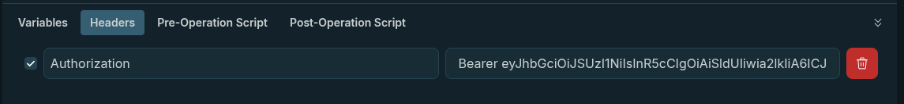

# Start minikube

```bash
minikube start
```

or

```bash
minikube start --driver=docker   --extra-config=kubeadm.ignore-preflight-errors=Swap   --extra-config=kubelet.enforce-node-allocatable=""
```

# Apply manifests

```bash
kubectl apply -f kubernetes/services/ -n fleet-manager
```

# Create a global config file for environment variables

```bash
kubectl create configmap global-fleet-config --from-env-file=.env -n fleet-manager
```

# Run the Keycloak and Api Gateway services in kuberntes

```bash
sh start-demo.sh
```

Apollo at http://localhost:8080
Keycloak at http://localhost:8081

# get the access token

```bash
curl -X POST 'http://localhost:8080/realms/fleet-manager/protocol/openid-connect/token' -H 'Content-Type: application/x-www-form-urlencoded' -d 'grant_type=password'
-d 'client_id=api-gateway' -d 'client_secret=dzT2qEBxZKstFp0iZo4x0rNnhEMmjMUu' -d 'username=XXXX' -d 'password=XXXX' -d 'scope=openid'
{"errors":[{"message":"Context creation failed: You must be logged in","extensions":{"code":"UNAUTHENTICATED","exception":{"stacktrace":["AuthenticationError: Context creation failed: You must be logged in"," at ApolloServer.context (/app/src/index.js:96:23)"," at ApolloServer.graphQLServerOptions (/app/node_modules/apollo-server-core/dist/ApolloServer.js:511:34)"]}}}]}
```

change username and password with the creds of the user you created in keycloak

copy the access token and create a new header in appolo

```
Authorization: Bearer <access_token>
```



# Checking logs

for the vehicle service for example, run the following command:

```bash
kubectl logs -l app=vehicle-service -n fleet-manager -f
```
